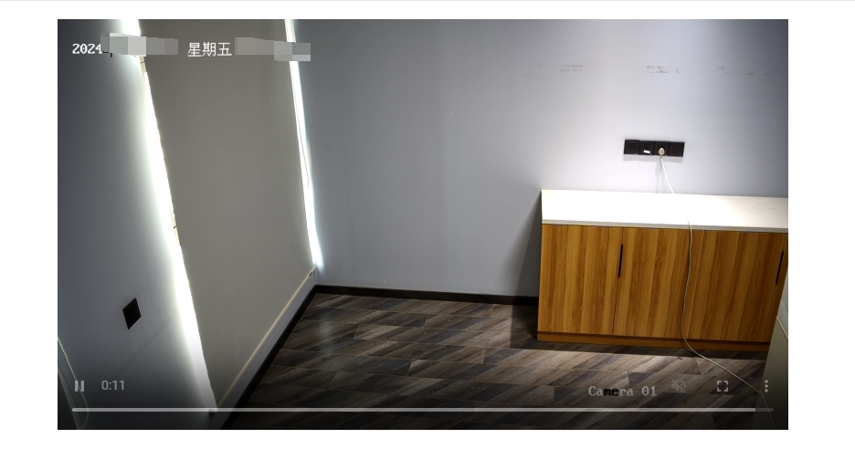
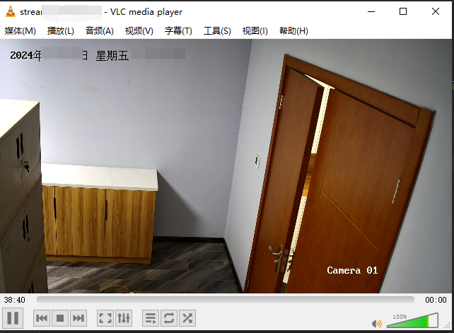

<!-- easyflv: Java RTSP/RTMP to FLV Converter -->

# 📺 easyflv: 基于javacv实现的 rtsp/rtmp 转 flv格式封装

## 🚀 快速开始

### 添加依赖

在你的 Spring Boot 项目中，添加依赖：

- maven

```xml

<dependency>
    <groupId>com.zbinyds.easyflv</groupId>
    <artifactId>easyflv-spring-boot-starter</artifactId>
    <version>您使用的版本</version>
</dependency>
```

- gradle

```
implementation 'com.zbinyds.easyflv:easyflv-spring-boot-starter:您使用的版本'
```

### 使用说明

在您的 Spring Boot 项目中

1. 方式一、通过注解 `@EnableEasyflv` 开启 easyflv 模块;

```java

@EnableEasyFlv // 开启 easyflv
@SpringBootApplication
public class Application {

    public static void main(String[] args) {
        SpringApplication.run(Application.class, args);
    }
}
```

2. 方式二、扩大包扫描范围，将 `com.zbinyds.easyflv` 包添加到 `@ComponentScan` 注解中。

```java

@ComponentScan({"您自己当前包路径", "com.zbinyds.easyflv"}) // 扩大包扫描范围
@SpringBootApplication
public class Application {

    public static void main(String[] args) {
        SpringApplication.run(Application.class, args);
    }
}
```

启用easyflv后，通过属性注入的方式获取 `FlvHelper` 对象，然后调用 `FlvHelper` 对象的 `open` 方法即可。`

```java

@RestController
@RequestMapping("/flv")
@RequiredArgsConstructor
public class FLVController {
    private final FlvHelper flvHelper;

    @GetMapping("/stream_{channel}.flv")
    public void flvConvert(@PathVariable("channel") String channel, HttpServletResponse response, HttpServletRequest request) {
        String url = "您的rtsp地址" + channel;
        flvHelper.open(url, response, request);
    }
}
```

至此，您就可以通过您指定的请求，获取flv格式的视频流数据了。<br />
例如上述示例代码，可以通过 `http://ip地址:端口号/flv/stream_1.flv` 获取视频流数据。<br />
前端可直接借助flv.js播放视频流，也可以通过vlc播放器测试是否成功转换。<br />
实测，海康摄像头延迟在2-3s左右，具体和网络带宽有关

## 📄 效果图

以下是使用 easyflv 转换后的效果图：




## 📧 联系

- Email: [zbinyds@126.com](mailto:your-email@example.com)